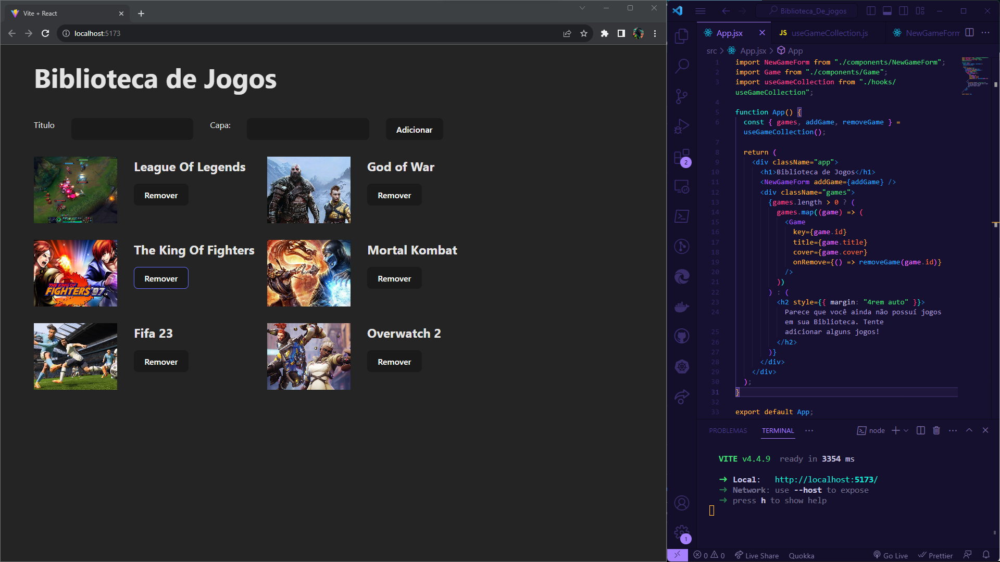

# Biblioteca de Jogos

Uma aplicação de biblioteca de jogos simples, onde os usuários podem adicionar e remover jogos da sua coleção.

## Visão Geral

A "Biblioteca de Jogos" é uma aplicação que permite aos usuários gerenciar sua coleção de jogos. Os principais recursos incluem:

- Adicionar novos jogos à coleção.
- Remover jogos da coleção.
- Visualizar a lista de jogos na coleção.

## Tecnologias Utilizadas

- React: Biblioteca JavaScript para construção de interfaces de usuário.
- Vite

## Capturas de Tela

## Pré-requisitos

Certifique-se de ter o Node.js e o npm instalados em seu ambiente.

## Instalação

1. Clone este repositório: `git clone https://github.com/philipeagra?tab=repositories`
2. Acesse o diretório do projeto: `cd seu-repositorio`
3. Instale as dependências: `npm install`

## Uso

1. Inicie a aplicação: `npm start`
2. Abra o navegador e acesse `http://localhost:3000`.
3. Adicione novos jogos à sua coleção usando o formulário.
4. Remova jogos clicando no botão "Remover" ao lado do jogo.

## Contribuição

Contribuições são bem-vindas! Siga as etapas abaixo:

1. Faça um fork deste repositório.
2. Crie uma branch para a sua feature: `git checkout -b minha-feature`
3. Faça as alterações e faça commit: `git commit -m "Minha nova feature"`
4. Envie as alterações para o GitHub: `git push origin minha-feature`
5. Abra um Pull Request.

## Autor

- Nome: Philipe Agra
- GitHub: [philipeagra](https://github.com/philipeagra)
